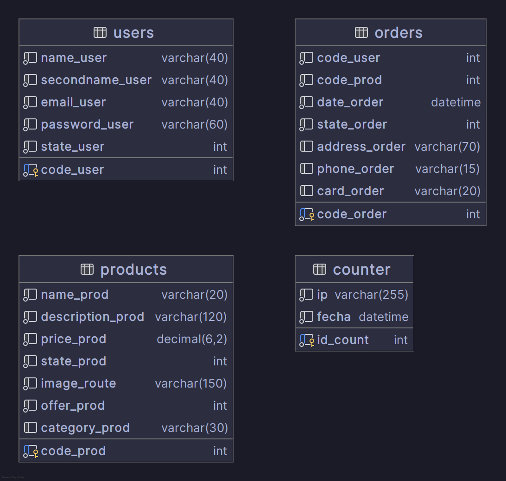
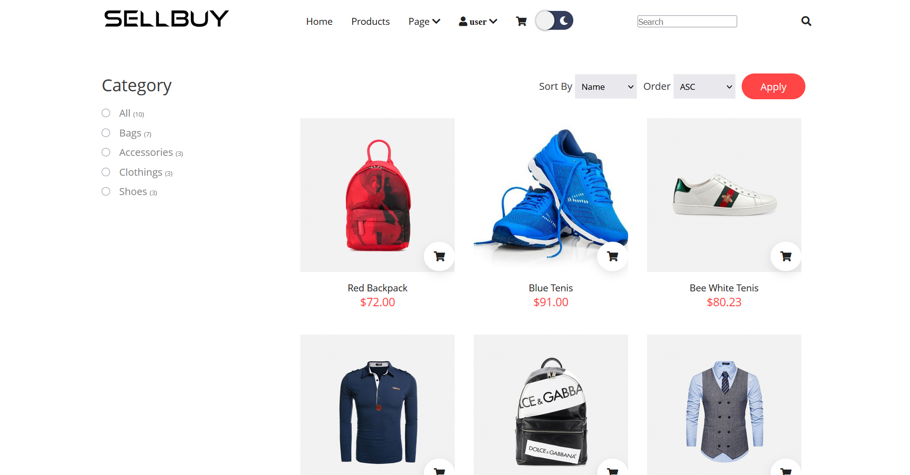

# SellBuy E-Commerce

## Table of Contents
- [About the Project](#about-the-project)
- [Main Features](#main-features)
- [Built With](#built-with)
- [Entity Relationship Diagram (ERD)](#entity-relationship-diagram)
- [Getting Started](#getting-started)
    - [Prerequisites](#prerequisites)
    - [Installation](#installation)
- [Overview](#overview)

---

## About the Project


<b>Sellbuy</b> is an e-commerce platform, developed in PHP, offers the online sale of unisex clothing and accessories. It provides a user-friendly interface, secure purchasing, and efficient product management to deliver a seamless shopping experience.

### Main Features:
- User authentication with email and password.
- Sign Up & Sign In.
- Database implementation with Docker.
- API documentation with Springdoc.
- JSON serialization/deserialization with Jackson.
- Simplified code with Lombok.


## Built With

- **PHP**: Framework for robust Java application development.
- **HTML, CSS and JavaScript**: Handles UI/UX and functionality on the Web Client.
- **MySQL**: Relational database.
- **Docker**: Container Management.


---


## Entity Relationship Diagram


---

## Getting Started

### Prerequisites

Ensure you have the following installed:
- PHP 8 or higher.
- Docker for container management
- MySQL configured and running locally with Docker.


### Installation

1. Clone the repository and install dependencies:
   ```bash
   git clone https://github.com/anthonygrr/sellbuyEcommerce.git
   cd sellbuyEcommerce
   ```

2. Run the docker-compose.yml file, it will run the Database Container with the initial scripts.
    ```bash
   docker compose up -d
   ```

4. Start the application:
   ```bash
   php -S localhost:3000
   ```

---


## Overview

### Home Page


### Sign In


### Products Page


### Cart Section


### About Section


